Github Repo 地址:
> https://github.com/gmsShanghai/vault-test

--- 
## 2024-04-10 更新说明
在首页默认是3rd Party 模式了, 现在每一个页面的customerID都可以输入

## 2024-04-07 更新说明
BrainTree 测试卡号地址:
> https://developer.paypal.com/braintree/docs/guides/3d-secure/testing-go-live/ruby

## 2024-04-02 更新说明

1. 项目构成
   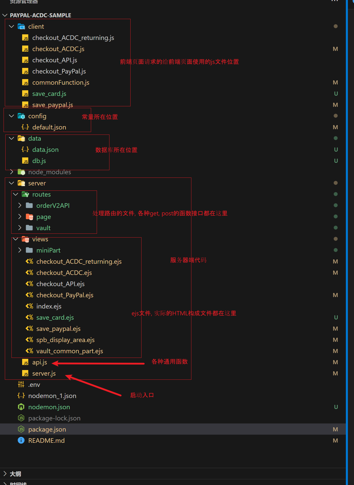
   主要由服务器端和客户端构成, 服务器端使用`nodejs`, 服务器端和客户端的 js 代码均遵循`ES module`规范而不是`CommonJS`规范, (也就是使用`import`而不是`require`). 在开发后期, 为了管理复杂的`Vault`情景中的各种状态, 引入了不需要额外安装的数据库模块`lowdb`. 页面中存储的各种`VaultID`和`CustomID`都存储在这里

2. 启动方式

    - `npm install` 安装依赖
    - `npm start` 启动项目  
      启动端口可以在这里修改:  
      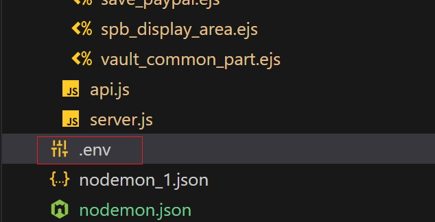
      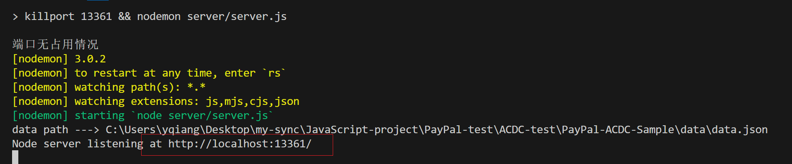

3. 页面使用
   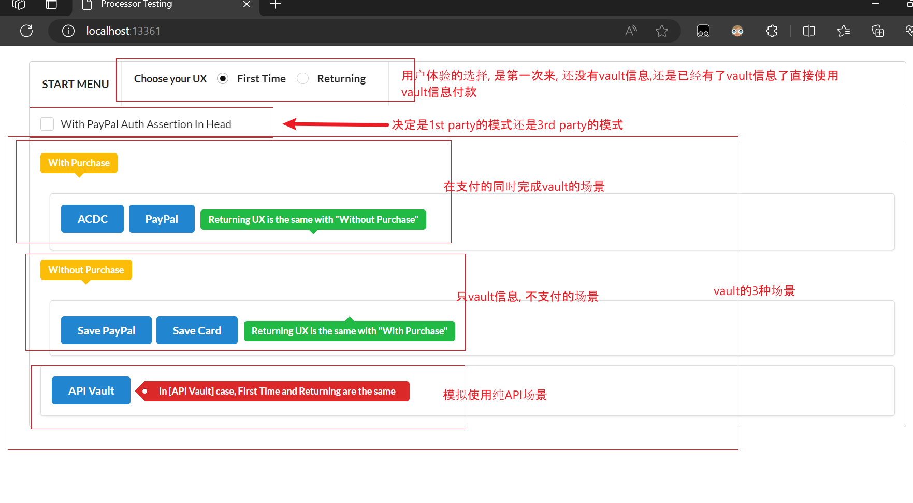
   使用展示:
    - 在导览页面选择要测试的场景
      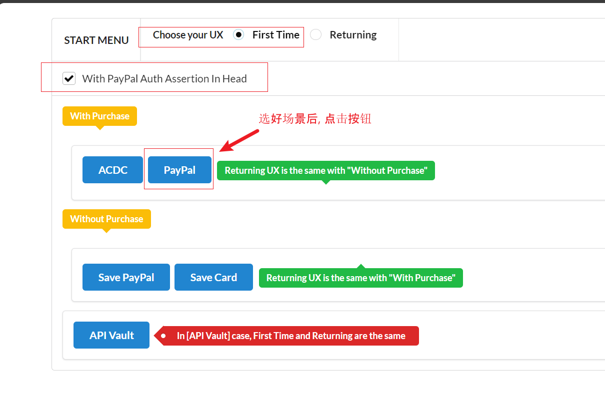
    - 页面跳转, 同时服务器端会输出各种日志
      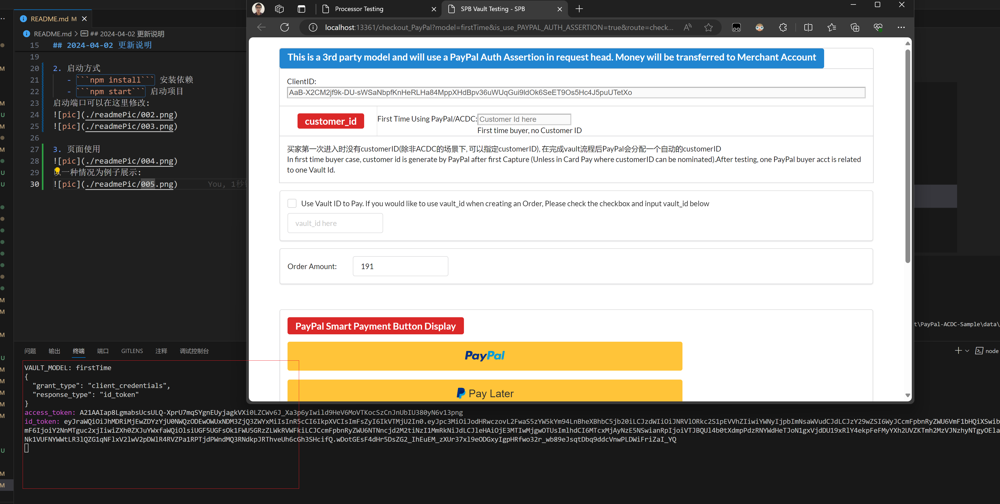
    - 进行支付
      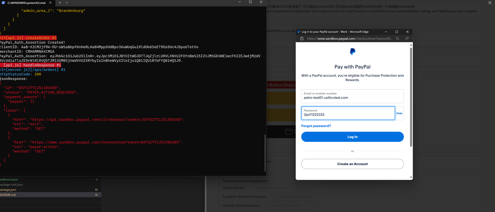
    - 支付完成后, 在服务器日志, 页面控制台, 和页面中都会显示交易信息和 vault 内容
      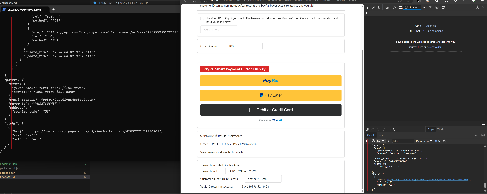
    - 此时 DB 文件中的内容会被修改, 作为`returning buyer`的使用信息
      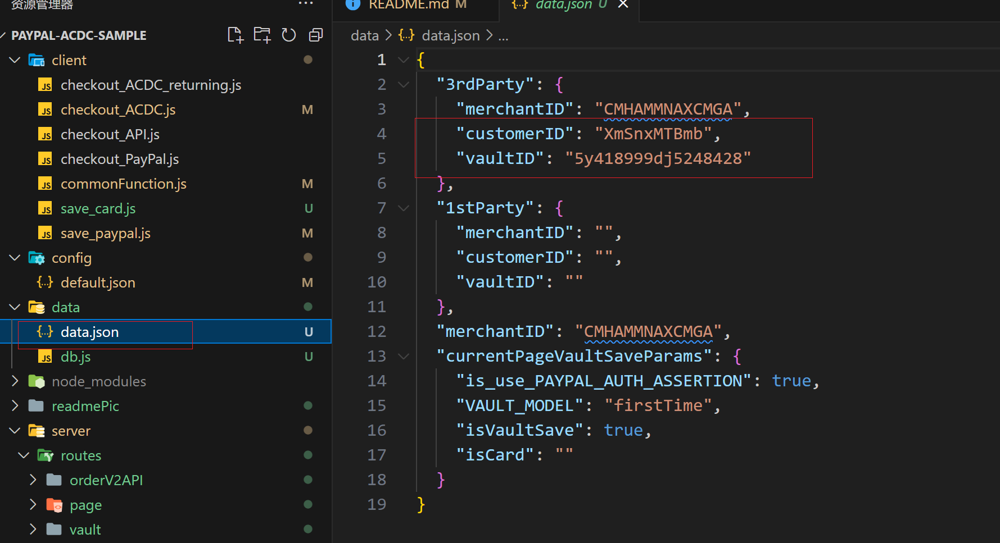
    - 回到导览页面测试`returning buyer`的情况
      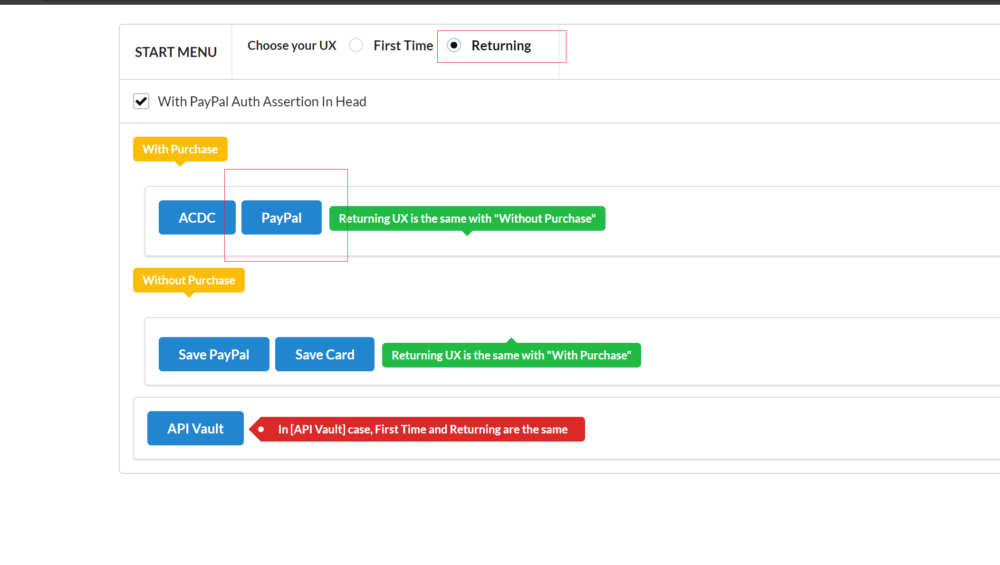
    - vault 信息已经都被展示出来
      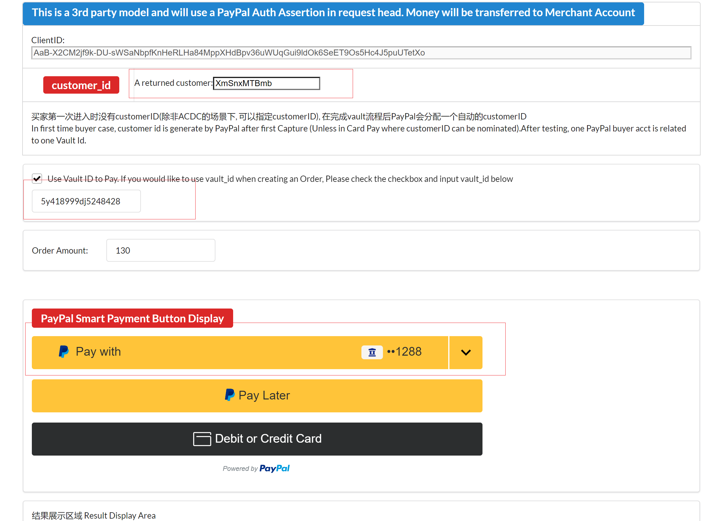

    有一个略有不同的地方, 在ACDC中, `customerID`可以选择填写或者不填写.
    填写的情况, 需要手动修改`config`文件. 会在之后做代码修改
    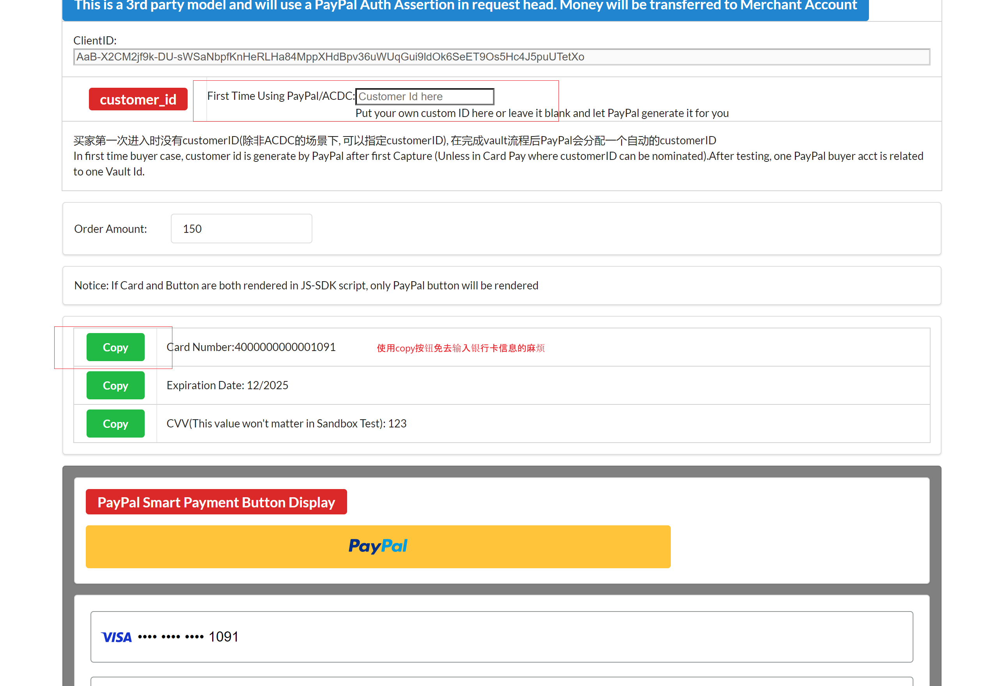
---

## [2024-02]first comment

这个案例项目的结构是一个用 express 来 hold 单 HTML 页面的例子, 这么做有以下几个好处

-   前后端可以一起启动, 因为涉及使用 express 服务器与 PayPal 服务器的通讯, 模拟真实环境的 OrderV2
-   因为页面不涉及复杂的动态组件变化/路由/状态管理, 所以不用使用复杂框架(vue/react) <<< 写到后来后悔了, 在加入 Vault 的测试之后, 状态管理变得很复杂, 没有用现代框架使
-   但是依然有一些类似 client_id/secret 的变量是动态的, 使用纯静态的 HTML 文件也不合适, 在这里使用的一个折中方案: HTML 模板引擎, 和上古年代的 JSP 有点理念上的类似

项目的入口文件是 `/server/server.js`  
`package.json`文件中已经指定了`"type": "module"`, 可以使用`import`语法  
可以在这个地址获取测试用的卡号:

> https://developer.paypal.com/api/rest/sandbox/card-testing/#link-creditcardgeneratorfortesting

~~注意, 虽然官方说了 express 现在可以用 express.json()作为处理请求体的中间件, 但是没有生效, 依然需要使用 body-parser 第三方包作为中间件~~ (express.json 的确可以作为作为处理请求体的中间件)
